# Rapport TP3 - Orchestration avec Docker Compose

## Informations
- Etablissement: Institut Superieur d'Informatique
- Departement: GTR
- Module: Cloud Computing et Virtualisation
- Groupe: M1 SSII
- Enseignant: Safa Rejichi
- Etudiant: Talel Chaanbi
- Date: 19/04/2026

## Objectifs du TP
- Manipuler Docker Compose.
- Orchestrer deux services: Application Web et Base de donnees.

## Partie 1 - Installation de Docker Compose
### Commandes utilisees
- sudo apt-get update
- sudo apt-get install docker-compose-v2
- docker compose version

Alternative (si le paquet n'existe pas dans les depots):
- mkdir -p ~/.docker/cli-plugins
- curl -SL https://github.com/docker/compose/releases/download/v2.29.7/docker-compose-linux-x86_64 -o ~/.docker/cli-plugins/docker-compose
- chmod +x ~/.docker/cli-plugins/docker-compose
- docker compose version

### Verification
Docker Compose est installe et la commande docker compose est disponible.

Capture a inserer:
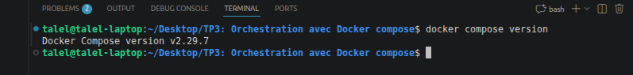
Legende: Verification de l'installation Docker Compose avec la commande docker compose version.

## Partie 2 - Orchestration avec docker-compose

## I. Creation et demarrage des conteneurs
Arborescence du projet:
- sources/app/db-config.php
- sources/app/index.php
- sources/app/validation.php
- sources/db/articles.sql
- sources/db/Dockerfile
- docker-compose.yml

### Dockerfile Base de donnees
Le service db est construit avec un Dockerfile dedie:
- Base image: mysql:5.7
- Script init: articles.sql copie dans /docker-entrypoint-initdb.d

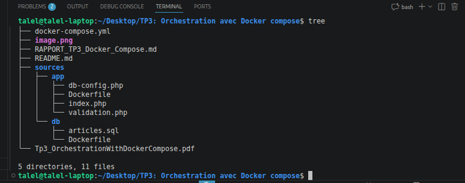
Legende: Arborescence du projet (sources/app, sources/db, Dockerfile et docker-compose.yml).

### Explication du fichier docker-compose.yml
Le fichier orchestre deux services sur le meme reseau bridge app_net:
- service db:
  - build depuis sources/db
  - variables MYSQL_ROOT_PASSWORD, MYSQL_DATABASE, MYSQL_USER, MYSQL_PASSWORD
  - volume nomme db_data pour persister les donnees MySQL
  - healthcheck mysqladmin ping pour verifier la disponibilite de la base
  - port publie 3306:3306
- service app:
  - build depuis sources/app
  - port publie 8080:80
  - depends_on avec condition service_healthy pour attendre db
  - connecte au reseau app_net
- reseau:
  - app_net avec driver bridge
- volume:
  - db_data

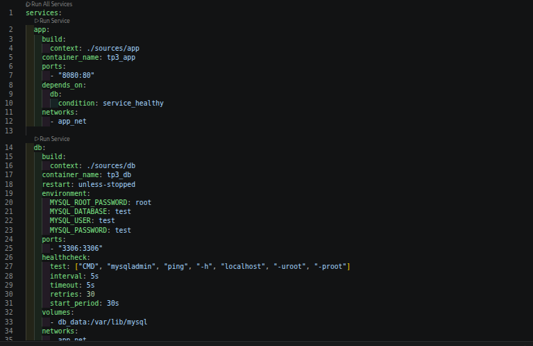
Legende: Contenu du fichier docker-compose.yml (services app et db, reseau et volume).

### Changement dans db-config.php
Le host de connexion a ete change de localhost vers db:
- DSN utilise: mysql:host=db;dbname=test

Explication:
- localhost pointe vers le conteneur courant.
- la base est dans un autre conteneur.
- le nom de service db devient un nom DNS interne sur app_net.
- app se connecte donc a db via le reseau Docker.

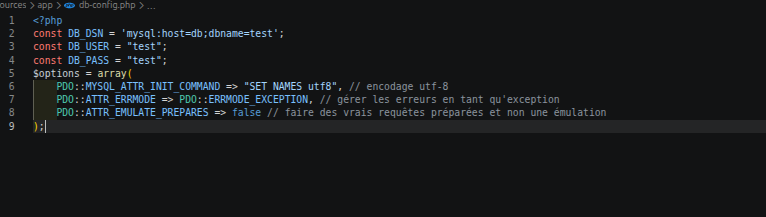
Legende: Fichier db-config.php avec host=db pour la connexion inter-conteneurs.

### Demarrage
Commande executee:
- docker compose up -d --build

Verification:
- docker compose ps

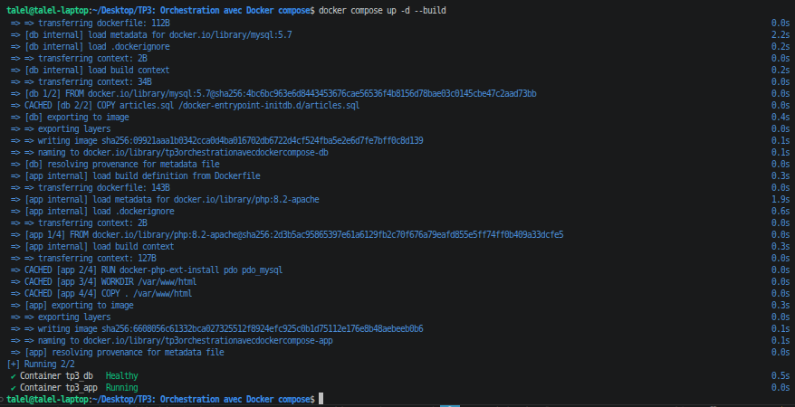
Legende: Execution de docker compose up -d --build pour creer et demarrer les conteneurs.
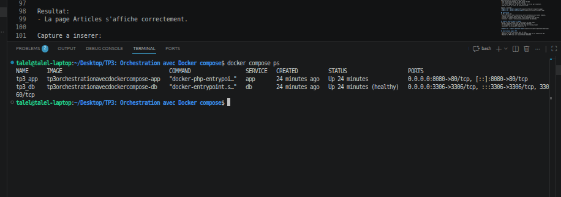
Legende: Etat des services via docker compose ps (app Up et db Up/healthy).

## II. Test de la page web
URL testee:
- http://localhost:8080

Resultat:
- La page Articles s'affiche correctement.

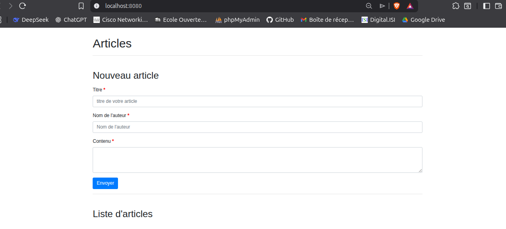
Legende: Affichage de la page web Articles sur http://localhost:8080.

## III. Ajout d'un article et verification
Etapes:
- Remplir le formulaire (titre, auteur, contenu)
- Valider
- Verifier la presence de l'article dans la liste

Resultat:
- L'article est bien ajoute et affiche.

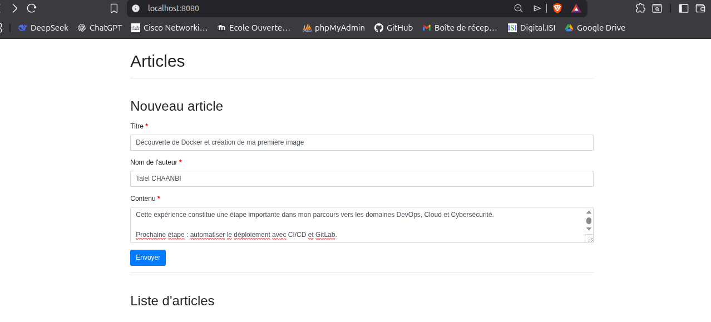
Legende: Formulaire de nouvel article rempli (titre, auteur, contenu).
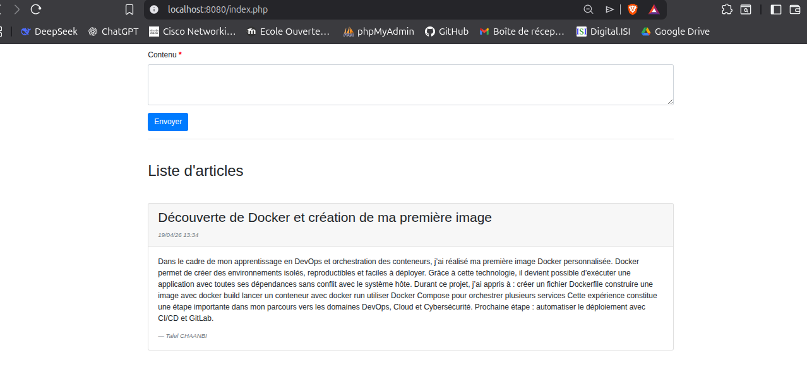
Legende: Verification de l'ajout de l'article dans la liste.

## IV. Adresses IP des conteneurs et relation avec app_net
Commandes:
- docker inspect tp3_app --format '{{range .NetworkSettings.Networks}}{{.IPAddress}}{{end}}'
- docker inspect tp3_db --format '{{range .NetworkSettings.Networks}}{{.IPAddress}}{{end}}'
- docker network inspect tp3orchestrationavecdockercompose_app_net

Resultats observes:
- IP conteneur app: 172.18.0.3
- IP conteneur db: 172.18.0.2
- Reseau app_net:
  - driver: bridge
  - subnet: 172.18.0.0/16
  - gateway: 172.18.0.1

Explication de la relation avec app_net:
- app et db sont attaches au meme reseau bridge.
- ils communiquent en IP privee interne.
- le service app joint db par son nom DNS db et non par localhost.
- app_net isole ce trafic du reste de l'hote.

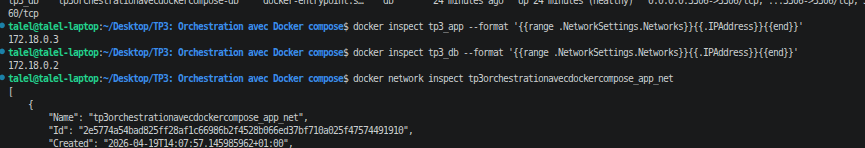
Legende: Adresses IP des conteneurs obtenues avec docker inspect.
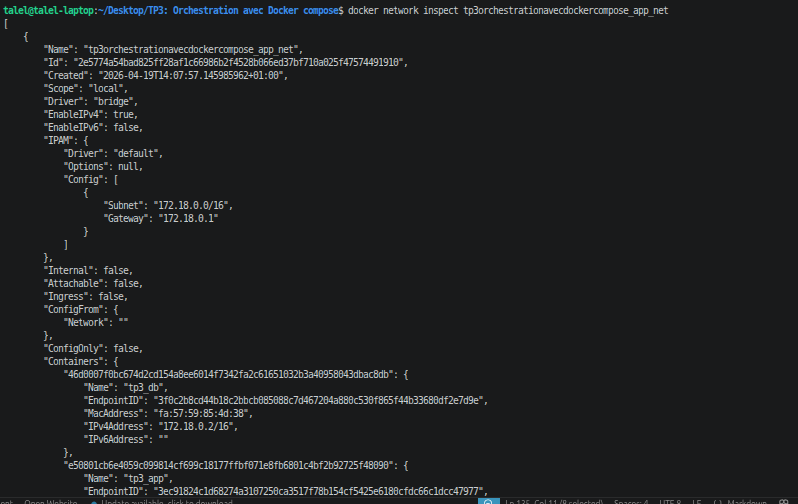
Legende: Details du reseau app_net obtenus avec docker network inspect.

## Conclusion
Ce TP a permis de:
- mettre en place une orchestration multi-conteneurs avec Docker Compose,
- separer clairement application web et base de donnees,
- valider la communication reseau inter-conteneurs via app_net,
- verifier l'ajout d'articles avec persistance des donnees.

